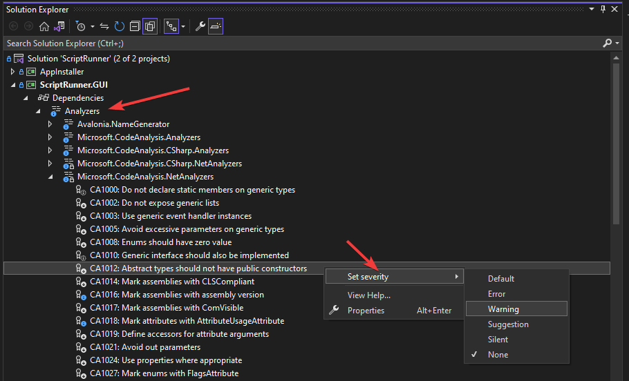
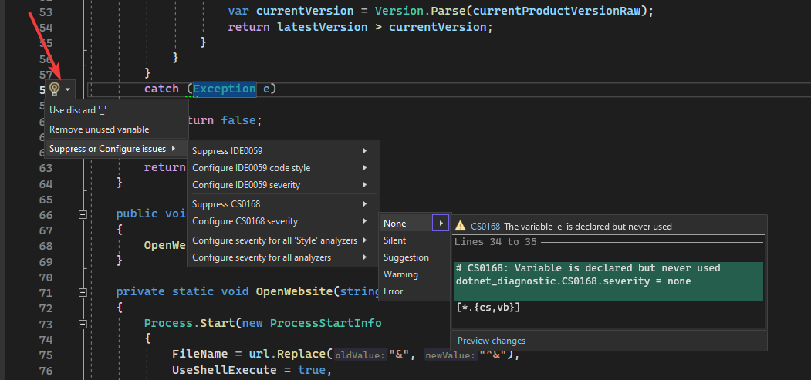

# Dotnet code analysis essential setup
A quick guideline how to setup static code analysis for dotnet project with a list of essential analyzer packages.

[Overview of .NET source code analysis](https://learn.microsoft.com/en-us/dotnet/fundamentals/code-analysis/overview?tabs=net-7)

## How to enable built-in static code analysis

Add [Directory.Build.props](https://learn.microsoft.com/en-us/visualstudio/msbuild/customize-your-build?view=vs-2022) file with the content as below in the same directory as solution file:

```xml
<Project>
 <PropertyGroup>
   <!-- Required only when TargetFramework older than .NET v5 -->
   <EnableNETAnalyzer>true</EnableNETAnalyzer>
   <!-- Enable Code-style analysis during the build, mostly for enforcing IDEXXXX rules-->
   <EnforceCodeStyleInBuild>true</EnforceCodeStyleInBuild>
   <!-- In the default analysis mode only a small number of rules are enabled as build warnings. Available options: None|Default|Minimum|Recommended|All -->
   <AnalysisMode>Recommended</AnalysisMode>
 </PropertyGroup>
  <ItemGroup>
    <!-- Required only when using .NET SDK older than v5 or to explicitly control analyzer package version -->
    <PackageReference Include="Microsoft.CodeAnalysis.NetAnalyzers" Version="7.0.0">
      <PrivateAssets>all</PrivateAssets>
      <IncludeAssets>runtime; build; native; contentfiles; analyzers</IncludeAssets>
    </PackageReference>
  <ItemGroup>
  <ItemGroup>
    <!-- Share rules settings across all projects in solution -->
    <None Include="$(MSBuildThisFileDirectory)\.editorconfig" Link=".editorconfig" />
  </ItemGroup>
</Project>
```

## How to setup severity for a particular rule

### Using dedicated editor for .editorconfig



### Using solution explorer


### Directly from code editor



### Manually edit `.editorconfig` file

If you are not using VisualStudio then you can configure specific analyzer by manually changing content of `.editorconfig` file

```editorconfig
[*.cs]

# CA1012: Abstract types should not have public constructors
dotnet_diagnostic.CA1012.severity = error
```